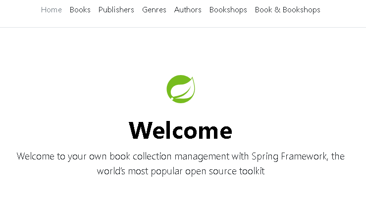
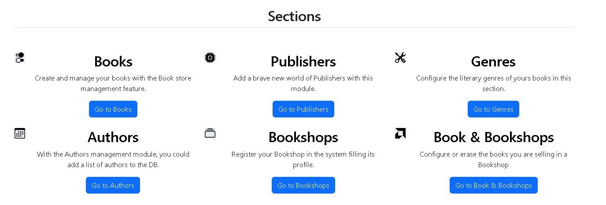
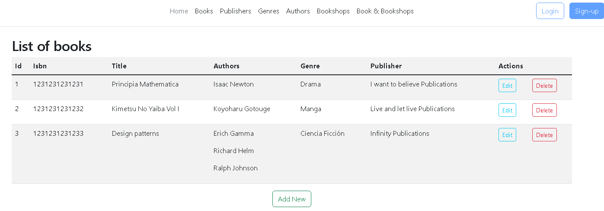
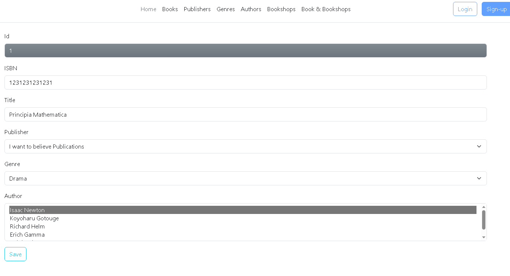

# SpringBasicBooksManagement 

Monolithic architecture MVC with Spring Framework for managing a book collection.


## Table of contents

- [Installation](#installation)
- [Usage](#usage)
- [It's not a bug, it's a feature](#features)
- [Maintainers](#maintainers)
- [License](#license)


## Installation

Just cloning or downloading the project. Other option is to use the online version

## Usage

- Easiest way is to try [SpringBasicBooksManagement](https://springbasicbookmng.onrender.com/) hosted in [Render](https://render.com/)

- Maybe you prefer to open it from you favorite IDE

- Or you could use the jar file hosted in /target. For this, run this command from the folder and visit localhost:8080

```
java -jar book-app-1.0.jar
```

- Also, you can use [Docker](https://docs.docker.com/engine/install/). Whether it is your flavor, first, from the inside of the main project folder, build the image using the settings from Dockerfile

```
docker build -t spring-books-mng .
```

&nbsp;&nbsp;&nbsp;&nbsp;Then create and run a container with, for instance, these settings

```
docker run --name spring-books-mng-container -p 8080:8080 -d spring-books-mng
```

&nbsp;&nbsp;&nbsp;&nbsp;Finally use your browser to visit localhost:8080


## Features

### Backstage

#### :zap: JUnit test in business logic classes

#### :zap: Spring Security included and pre-configured

#### :zap: Jakarta validations and HTML patterns in MVC layers

#### :zap: Dynamic web pages with the Thymeleaf template engine

#### :zap: Developed with an H2 in-memory database with incorporated data


### PhotoCall

#### :zap: Welcome to your own book collection management with Spring Framework, the world’s most popular open source toolkit.



#### :zap: Enjoy with our different sections in order to manage your amazing book collection



#### :zap: Clear list of items with main characteristics



#### :zap: Edit without problems the attributes of any element




## Maintainers

Just me, [Iván](https://github.com/Ivan-Montes)


## License

---

[](https://www.java.com/es/)
[](https://https://maven.apache.org/)
[](https://spring.io)
[](https://github.com)
[](https://https://eclipse.org/)
[](https://www.sonarsource.com/products/sonarqube/downloads/)
[](https://www.docker.com/)
[](https://choosealicense.com/licenses/gpl-3.0/)