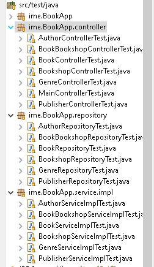

# SpringBasicBooksManagement 

Welcome to your own book collection management with Spring Framework, the world’s most popular open source toolkit.

## Table of contents

- [Installation](#installation)
- [Usage](#usage)
- [Maintainers](#maintainers)
- [Contributing](#contributing)
- [License](#license)

## Installation

You could Use the jar file hosted in /target or clone the whole project

## Usage

Try [SpringBasicBooksManagement](https://springbasicbookmng.onrender.com/) hosted in [Render](https://render.com/)

### :zap: Welcome to your own book collection management with Spring Framework, the world’s most popular open source toolkit.

### :zap: Enjoy with our different sections in order to manage your amazing book collection

### :zap: Clear list of items with main characteristics

### :zap: Edit without problems the attributes of any element

### :zap: JUnit test in every class

## Maintainers

Just me, [Ivan](https://github.com/Ivan-Montes)

## Contributing

Contributions are always welcome! 

## License

	
	
	